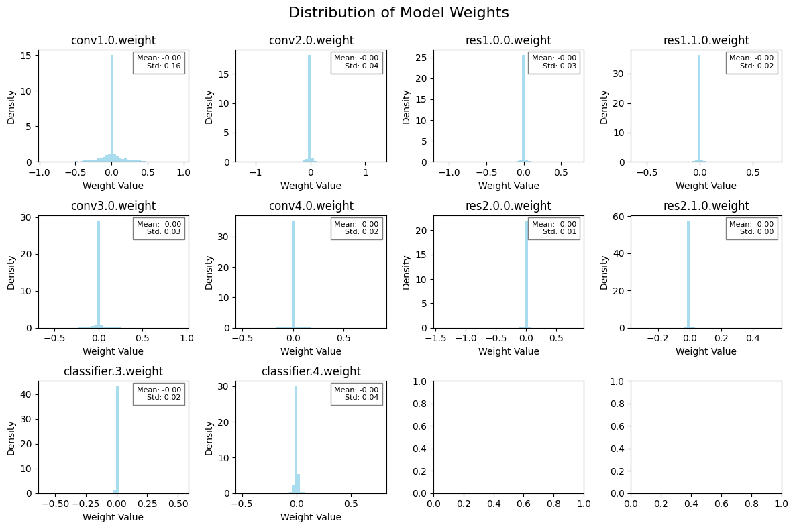
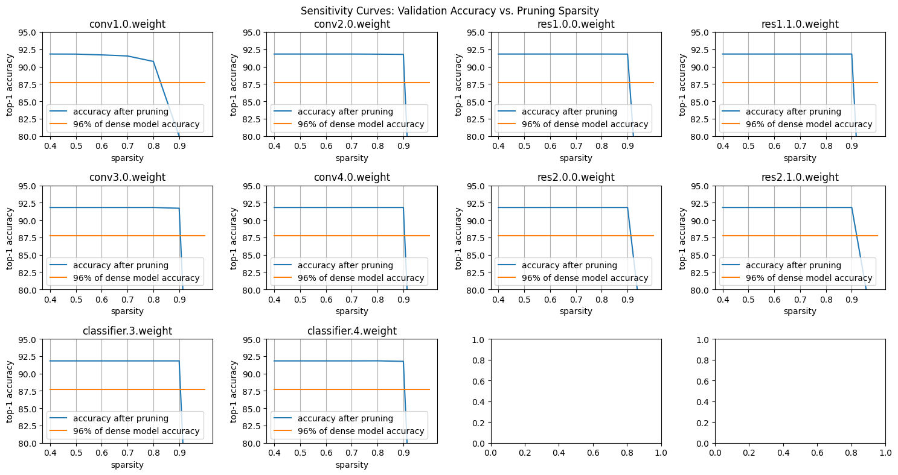

***Documentation for Sparsity and Pruning Assignment***

**Objective**:

The primary objective of this assignment is to develop a robust training loop for a neural network model using PyTorch, followed by evaluating its performance on a validation dataset. Additionally, the goal includes computing and analyzing the sparsity of the model's parameters. And the affect of pruning on size and accuracy

**Implementation Overview:**

Data Preparation:

Utilization of the CIFAR-10 dataset for training and validation purposes. CIFAR-10 comprises 60,000 32x32 color images categorized into 10 classes, each class containing 6,000 images.

Splitting the dataset into training and validation sets with a ratio of 90:10.

Model Architecture:

Adoption of the Neural network (custom )**Net10** as the base model for this assignment.

Training Loop:

Implementation of a training loop to train the model using the training dataset.

Iteration over a specified number of epochs, with each epoch containing multiple training steps.

Execution of the following steps during each training step:

Loading input images and labels from the training dataloader.

Forwarding the model with the input images to obtain predictions.

Computing the loss between the predicted and true labels using CrossEntropyLoss.

Performing backpropagation to compute the gradients.

Updating the optimizer based on the computed gradients.

Evaluation:

Evaluation of the trained model on the validation dataset after each epoch to measure its performance.

Calculation and printing of the accuracy of the model on the validation set.

**Sparsity Analysis:**

Computation of the sparsity of the model parameters using provided functions.

Calculation of the total number of parameters and the model size in bits.

Printing of the sparsity of the model for analysis purposes.

Usage Instructions:

Ensure that all required libraries, including PyTorch and torchvision, are installed.

Download the CIFAR-10 dataset and preprocess it using the provided code.

Initialize the optimizer and criterion for training purposes.

Execute the training loop by calling the train function with appropriate arguments.

Evaluate the trained model on the validation set using the evaluate function.

Analyze the sparsity of the model using the provided functions.

Monitor the training progress and analyze the results.

**Note:**

- This implementation assumes the availability of GPU for training. Adjust the device accordingly if running on a CPU-only system.
- Hyperparameters such as learning rate, batch size, and number of epochs can be adjusted based on experimentation and requirements.
- Further enhancements can be made by implementing techniques like model pruning and fine-tuning to optimize model performance and sparsity.

Error Handling and Solutions:

Error:

When attempting to load the trained model using torch.load**, a** RuntimeError **occurs due to a size mismatch in the final fully connected layer (**classifier.6**).**

**Solution:**

Modify the final fully connected layer to match the number of classes in CIFAR-10 before loading the trained model. This ensures that the model architecture matches the one used during training, resolving the size mismatch error.


**Due to achieving a maximum accuracy of 75% with the VGG16 model after 75 epochs, a decision was made to switch to a different approach using a custom neural network architecture (**Net10**). This architecture, with an increased size of 100 MB compared to the previous 25 MB, achieved a validation accuracy of 90% in just 10 epochs, demonstrating significant performance improvement.and 91.81% in 20 epochs**

**Model Architecture (Net10)**:
```python
class Net10(ImageClassificationBase):
    def __init__(self, in_channels, num_classes):
        super().__init__()

        self.conv1 = conv_block(in_channels, 128)  # Increase channels
        self.conv2 = conv_block(128, 256, pool=True)  # Increase channels
        self.res1 = nn.Sequential(conv_block(256, 256), conv_block(256, 256))

        self.conv3 = conv_block(256, 512, pool=True)  # Increase channels
        self.conv4 = conv_block(512, 1024, pool=True)  # Increase channels
        self.res2 = nn.Sequential(conv_block(1024, 1024), conv_block(1024, 1024))

        self.classifier = nn.Sequential(
            nn.MaxPool2d(4),
            nn.Flatten(),
            nn.Dropout(0.2),
            nn.Linear(1024, 512),  # Increase neurons
            nn.Linear(512, num_classes)  # Increase
        )

    def forward(self, xb):
        out = self.conv1(xb)
        out = self.conv2(out)
        out = self.res1(out) + out
        out = self.conv3(out)
        out = self.conv4(out)
        out = self.res2(out) + out
        out = self.classifier(out)
        return out

```


Training Hyperparameters:

- Epochs: 20
- Maximum Learning Rate: 0.01
- Gradient Clip: 0.1
- Weight Decay: 1e-4
- Optimizer Function: torch.optim.Adam


[**Weights of model**](https://drive.google.com/file/d/1_SIsdoGgsSs94GS-whSgizS9oQrxyE2m/view?usp=sharing)


After which i used mit lab as boilerplate to do a sensitivity scan on each level and determine the spaprcity I did on the range 0.4 to 1 sparsity other than few layers others didn't show any sensitivity at all which might mean{have to figure it out} i also found out the parameter determination as more sparcity in layers with highest no of parameters will reduce the model size most {what theorem is this }  the model after sparsing and pruning gave **10.27 Mib 10.05%** of dense model size Sparse model has accuracy=0.9162% before finetuning

Sparse model has accuracy=0.9205% after finetuning which  is  higher than dense model as the dese model due to higher training time didnt undergo muc  finetuning but due to reduction in size therefore reduction in training time allowed for more finetuning leading to higher accuracy


#### <a name="_69fqv3g3ffvo"></a>Weight Distribution before Sparcing including Zero paramneters

#### <a name="_ubyha7o6gdwl"></a>Weight Distribution after Sparcing  including only non Zero paramneters


I can see a overall reduction in density of weights due to  pruning

The sparsity is decided by no  of parameters of each layer and its sensitivity to change in sparsity,From the graphs its found that till 0.9 scarcity most layers are insensitive to change in scarcity and num of parameters are highest  for  'conv4.0.weigh;;res2.0.0.weight':'res2.1.0.weight

So I'm making the sparsticity for the first layer which is  also the most sensitive 0.6 and 0.9 for rest


#### <a name="_oc3ft3ncx2az"></a>Sensitivity plot

#### <a name="_jsma6uf4me6y"></a>Parameters plot



| Layer Name         | Sparsity |
|--------------------|----------|
| conv1.0.weight     | 0.6      |
| conv2.0.weight     | 0.9      |
| res1.0.0.weight    | 0.9      |
| res1.1.0.weight    | 0.9      |
| conv3.0.weight     | 0.9      |
| conv4.0.weight     | 0.9      |
| res2.0.0.weight    | 0.9      |
| res2.1.0.weight    | 0.9      |
| classifier.3.weight| 0.9      |
| classifier.4.weight| 0.9      |


